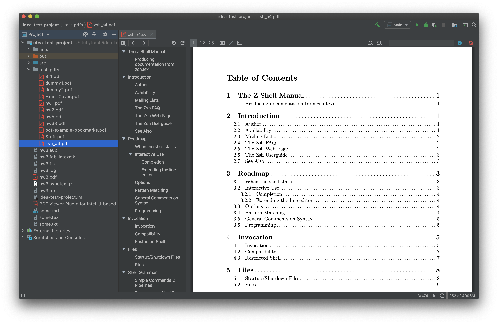

# IntelliJ PDF Viewer

[IntelliJ PDF Viewer](https://plugins.jetbrains.com/plugin/14494-pdf-viewer) plugin adds support for viewing PDF files in IntelliJ-based IDEs. This plugin uses recently integrated (`2020.2`) CEF (Chromium Embedded Framework) browser to render PDF documents with [PDF.js](https://mozilla.github.io/pdf.js/) library.

## Features

- Document navigation
- Presentation mode
- Text search*
- Document scaling
- Thumbnail view
- Sections list**
- Document information
- Auto-refresh on document change
- Pages spread (even/odd)
- Horizontal/vertical pages scroll directions

\* Search will work only in text-based documents. For example, it won't work in all-images documents (books scans).

** Document should define sections list. Otherwise, sections view won't be active.

## Use cases

- Split-view code and documentation
- Previewing latex documents
- Presentations with live-coding
- ...

## How it looks

## Installation

- Using IDE built-in plugin system:

  <kbd>Preferences</kbd> > <kbd>Plugins</kbd> > <kbd>Marketplace</kbd> > <kbd>Search for "PDF Viewer"</kbd> >
  <kbd>Install Plugin</kbd>

- Manually:

  Download the [latest release](https://github.com/FirstTimeInForever/intellij-pdf-viewer/releases/latest) and install it manually using
  <kbd>Preferences</kbd> > <kbd>Plugins</kbd> > <kbd>⚙️</kbd> > <kbd>Install plugin from disk...</kbd>

## Notes on JCEF support

Starting from `2020.2 EAP` (more precisely `202.4357.23-EAP-SNAPSHOT`) all IDEs should have bundled JCEF with `ide.browser.jcef.enabled` registry flag set to `true`. So the plugin should just work. If it doesn't work, please check if markdown plugin works fine. Check it's preview providers and confirm that JCEF is present.

### Builds before `2020.2 EAP`

You can't run this plugin without modifying `PdfEditorPanelProvider` with builds before `2020.2 EAP`. If you really want to - you should change JCEF presence detection with code from early versions (look at `0.0.4` tag).

Since CEF browser is still an experimental feature, there is a high chance that it is not shipped by default with your IDE. To be able to use CEF functionality you need to switch to version of JBR that supports it. See [this issue](https://youtrack.jetbrains.com/issue/IDEA-231833#focus=streamItem-27-3993099.0-0) for more details. You can learn how to switch IDE runtime [here](https://www.jetbrains.com/help/idea/switching-boot-jdk.html).

## Development

To build plugin use `buildPlugin` gradle task. This will produce ready to use `zip` archive with plugin contents.

To run/debug IDE with this plugin `runIde` task should be used.

### *Disclaimer*

This plugin is still in it's early stage, so some major bugs can occur.
